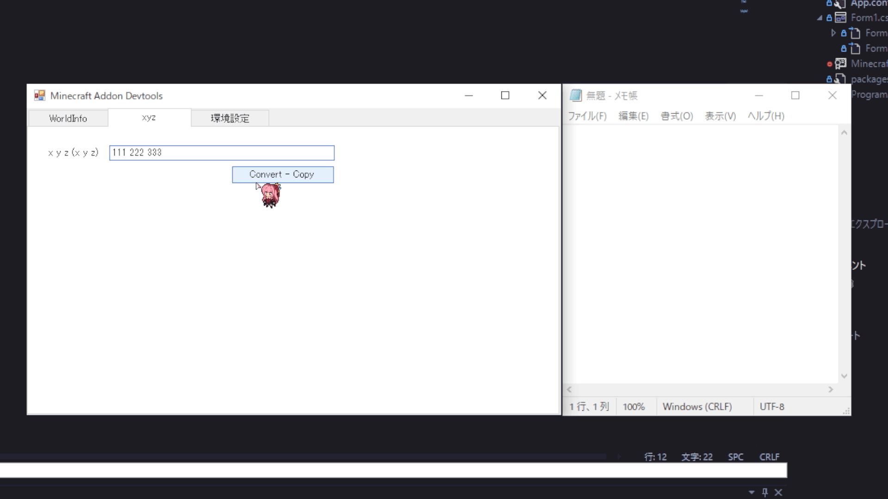

# Minecraft-Addon-Devtools
Minecraft Bedrock Addon/BehaviorPack 開発に便利なツールです。

## ✨ Features
### 🌏WorldInfo

- ワールドの一覧を、`ワールドフォルダ名 : ワールド名` として表示します
- `Enter`を押すとワールド一覧が表示されます
- ワールドを選択すると、サムネイルが表示されます
- 選択したのち、そのワールドのフォルダをエクスプローラーやVSCodeで開けます

### 📌xyz

- 座標を条件の書き方に変換してくれます
- `Convert - Copy` ボタンで、変換したものがクリップボードにコピーされます

- `100 200 300 111 222 333` のようなものも、`dx``dy``dz`が計算されます
- `111 200 333 100 222 300` のように大小を無視して入力しても、整形して出力されます

### 🔧環境設定
- ワールドの場所: Minecraftのワールドが入っているフォルダ
  - Bedrock Edition のパスは以下です（パスが異なる場合があります）
    ```
    C:\Users\自分のユーザー名\AppData\Local\Packages\Microsoft.MinecraftUWP_8wekyb3d8bbwe\LocalState\games\com.mojang\minecraftWorlds
    ```
  - Education のパスは以下です（パスが異なる場合があります）
    ```
    C:\Users\自分のユーザー名\AppData\Local\Packages\Microsoft.MinecraftEducationEdition_8wekyb3d8bbwe\LocalState\games\com.mojang\minecraftWorlds
    ```
- VSCodeの場所: Visual Studio Code の`code.exe`の場所

右下の`Save`で設定を保存できます

環境設定のファイルは以下にあります
```
%localappdata%\Minecraft-Addon-Devtools\settings.json
```

## ⚡ Requirements
- Windows 64bit

## 🚀 Getting Started
Assetsから`Release.zip`をダウンロードして任意の場所で解凍してください。
中にある`Minecraft Addon Devtools.exe`が実行ファイルです。
ショートカットを作っておくと開くのが楽になります。

## ❓ Issues
トラブルや分からないこと、改善案、欲しい機能などがあればIssuesに投げてください。

## 🧠 In future...
- WorldInfo
  - world.iconに画像DDで差し替え
- xyz
  - 環境設定で空白入れるか指定
  - 逆の変換も
- uuid generator
  - manifest.jsonなどを自動編集
  - MessageBoxでBeforeAfter表示
  - Checkerも作成
    - もしかしたらWorldInfoの方が良い？
- favorites
  - よく使うブロックの名前など保存しておける
    - ブロック
    - コマンド
    - パーティクル
    - 効果音
  - それぞれ key,value
